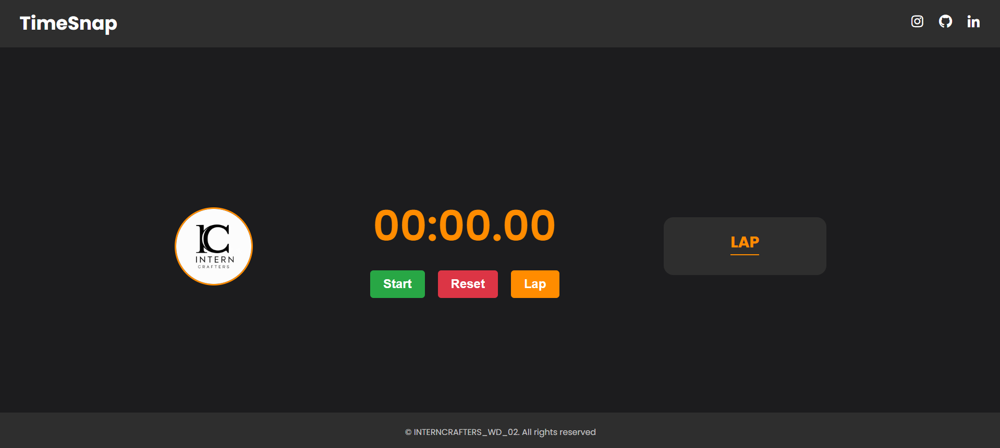

# INTERNCRAFTERS_WD_02
<p align="center">
<a href="#"></a>
</p>
<p align="center">
<a href="https://github.com/vxnuprasad"></a>
<a href="https://interncrafters.netlify.app/"></a>
</p>

# TimeSnap ( Stopwatch Web Application )

This project is a feature-rich, interactive **Stopwatch Web Application** built using **HTML**, **CSS**, and **JavaScript**. Users can start, pause, and reset the stopwatch, as well as track and record lap times. The design and functionality ensure an accurate and user-friendly time-tracking experience.

## Features

1. **Start, Pause, Reset:** 
   - Easily start, pause, or reset the stopwatch with intuitive buttons.
2. **Lap Time Tracking:**
   - Record multiple lap times while the stopwatch is running.
   - Display all recorded laps in a list format.
3. **Responsive Design:** 
   - Fully functional on both desktop and mobile devices.
4. **Accurate Time Tracking:**
   - Tracks time to milliseconds for precise measurements.
5. **Lightweight and Fast:**
   - Built with simple HTML, CSS, and JavaScript for quick load times and responsiveness.

---

## How It Works

1. **HTML:** Structures the stopwatch, buttons, and lap display area.
2. **CSS:** Styles the stopwatch for a clean, professional look and ensures responsiveness.
3. **JavaScript:**
   - Handles the core functionality for starting, pausing, resetting, and recording lap times.
   - Dynamically updates the stopwatch display and lap list.

## Usage

### Clone the Repository:
```sh
git clone https://github.com/vxnuprasad/INTERNCRAFTERS_WD_02
```

### Open in Browser:
1. Navigate to the project folder.
2. Open the `index.html` file in any web browser to view the stopwatch application.

---

## Contributions

If you find this project helpful, consider following [vxnuprasad](https://github.com/vxnuprasad) on GitHub! Feel free to fork the repository and contribute.

---

## Technologies Used

- **HTML:** To create the stopwatch structure and interface.
- **CSS:** To style the stopwatch for an appealing design and ensure responsive behavior.
- **JavaScript:** To implement the stopwatch's core functionality, including time tracking and interactivity.

---

## Find Me On:
[](https://www.linkedin.com/in/vxnuprasad)  
[](https://www.instagram.com/__.v.shnu/)  
